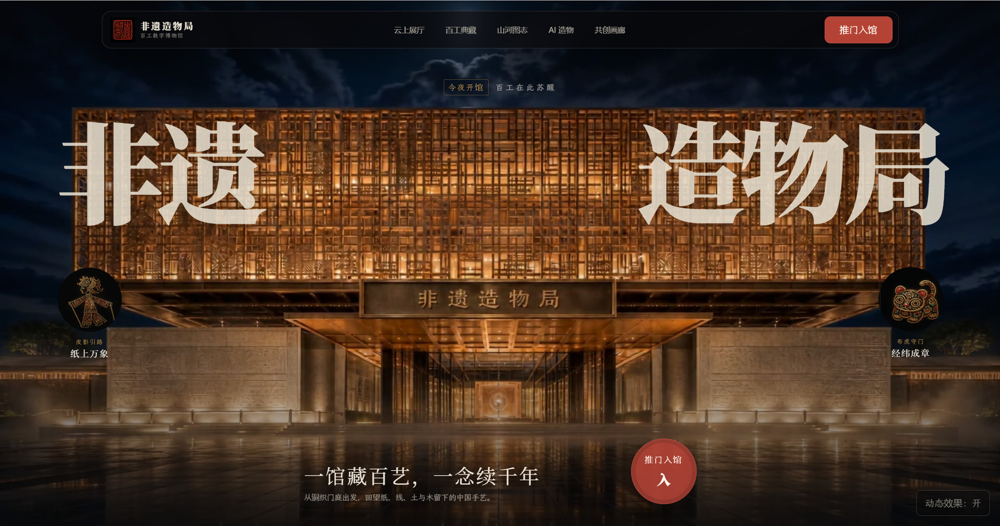
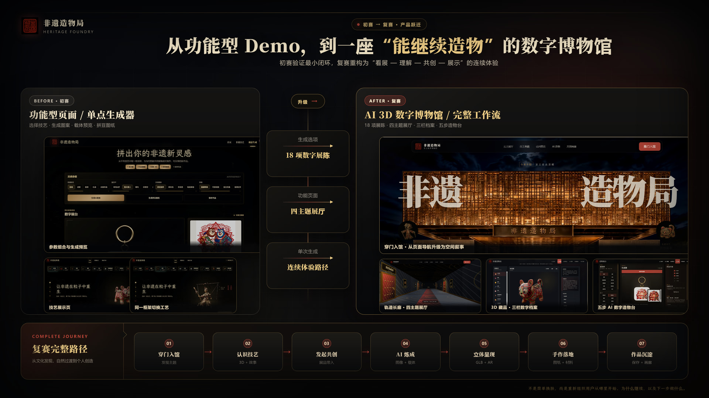
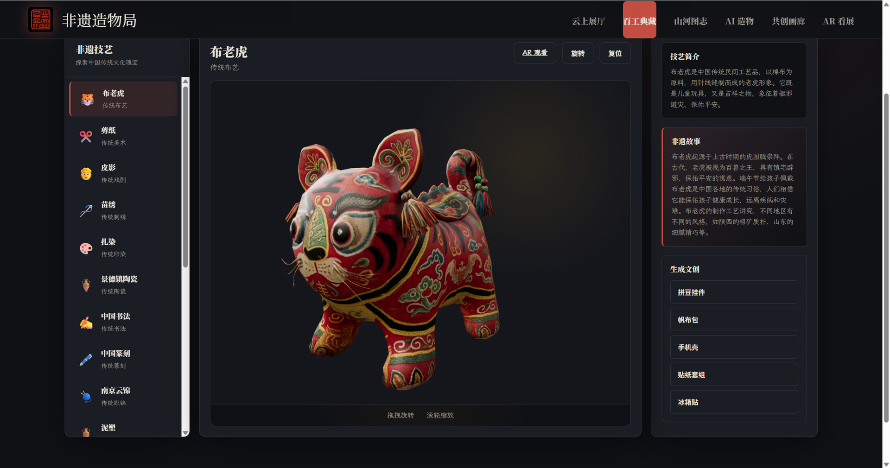
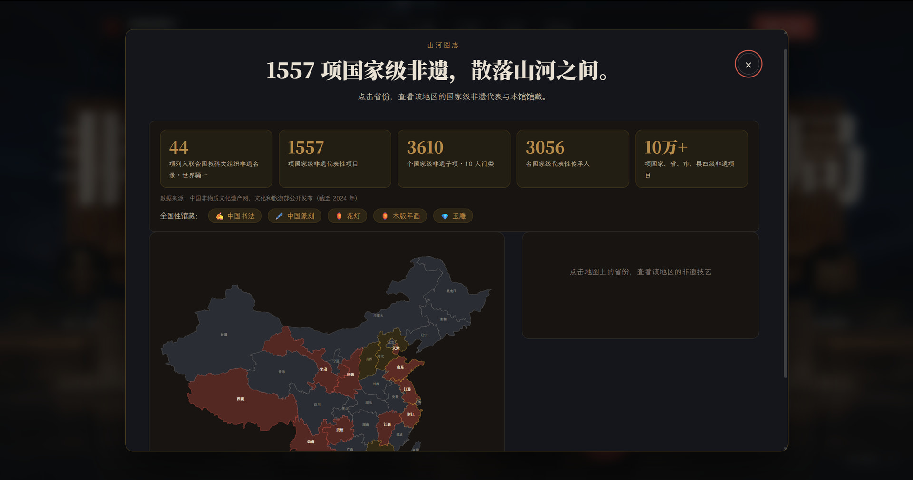
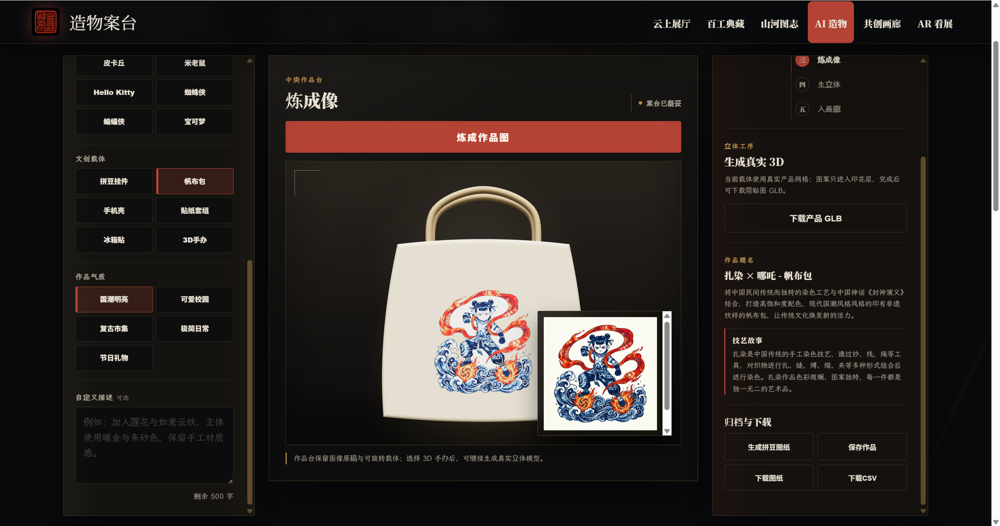
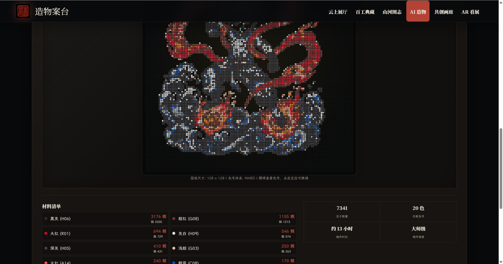
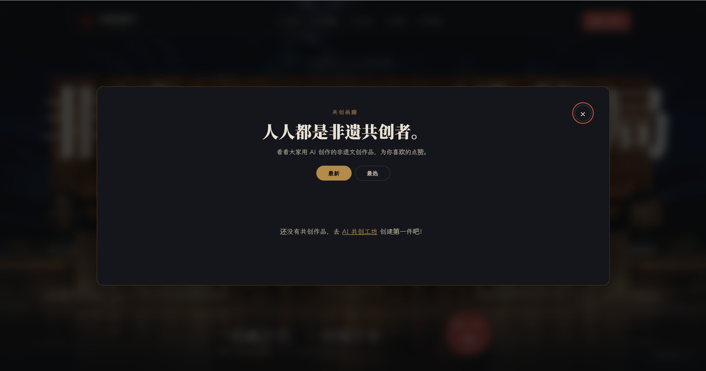

# 非遗造物局 · Heritage Foundry

> 从“看非遗”到“共创非遗”的 AI 3D 数字博物馆。

《非遗造物局》面向年轻人、手作爱好者、文创小店、校园与文旅活动组织者，以及希望用更年轻方式传播传统技艺的文化机构。项目将数字展陈、AI 图像生成、3D/AR 预览、拼豆图纸、材料清单和作品画廊串成一条连续体验，让用户从认识非遗走向理解、再设计和实际制作。

<p align="center">
  <a href="https://heritage-foundry.vercel.app"><strong>在线体验</strong></a> ·
  <a href="https://forum.trae.cn/t/topic/174775"><strong>TRAE 复赛项目帖</strong></a> ·
  <a href="docs/API.md"><strong>API 文档</strong></a>
</p>



本项目为 TRAE AI 创造力大赛复赛作品，主赛道为“生活娱乐”，同时关注非遗传播的社会公益价值。

## 项目亮点

- **沉浸式数字博物馆**：通过暗夜馆舍、3D 长廊和主题展厅组织空间叙事，内置 18 项非遗技艺资料与数字藏品。
- **3D 藏品与 AR 看展**：使用 Three.js 和 `<model-viewer>` 浏览、旋转与缩放藏品；支持的移动设备可将展品放入真实空间。
- **AI 非遗共创**：组合非遗技艺、流行元素、文创载体与视觉风格，通过 Gemini 生成方案图，并结合技艺数据形成创作说明。
- **真实 3D 生成**：线上使用 Meshy image-to-3D，本地开发可使用 TripoSR sidecar，统一输出可查看和下载的 GLB 任务结果。
- **手作落地工具**：把图像转换为拼豆网格，输出色号、用量、材料清单、制作时长与难度参考。
- **文化探索**：通过山河图志、技艺故事与地域数据，把视觉体验连接到文化背景。
- **共创作品沉淀**：借助 Supabase 保存公开作品、统计馆藏与共创数据，并支持最新/最热浏览和点赞。
- **可降级运行**：未配置 Gemini、Meshy 或 Supabase 时，基础展陈仍可使用，依赖能力会返回清晰的未配置状态或采用本地回退。

## 完整体验路径

| 阶段 | 用户行为 | 结果 |
| --- | --- | --- |
| 01 · 穿门入馆 | 从首页进入数字馆舍与主题展厅 | 发现非遗内容与空间线索 |
| 02 · 认识技艺 | 查看 3D 藏品、技艺简介与传承故事 | 建立文化背景与视觉认知 |
| 03 · 发起共创 | 选择技艺、流行元素、载体和风格 | 形成可执行的创作方向 |
| 04 · AI 炼成 | 生成或编辑非遗主题方案图 | 获得文创概念图与故事文案 |
| 05 · 立体呈现 | 预览载体材质，生成或下载 GLB | 检查作品的立体效果 |
| 06 · 手作落地 | 生成拼豆图纸、色号统计和材料清单 | 获得可制作的手作参考 |
| 07 · 作品沉淀 | 保存并公开作品，进入共创画廊 | 形成可持续的共创记录 |

## 产品演进



初赛验证了“选择技艺—生成图案—载体预览—拼豆图纸”的最小闭环；复赛进一步重构为“看展—理解—共创—展示”的数字博物馆体验，并补充 3D/AR、山河图志、作品画廊和真实 3D 生成能力。

## 运行截图

<table>
  <tr>
    <td width="50%" valign="top">
      
      <br><sub><strong>3D 非遗藏品：</strong>旋转浏览藏品，并查看技艺简介、传承故事与文创衍生选项。</sub>
    </td>
    <td width="50%" valign="top">
      
      <br><sub><strong>山河图志：</strong>通过全国数据和交互地图探索各省国家级非遗资源。</sub>
    </td>
  </tr>
  <tr>
    <td width="50%" valign="top">
      
      <br><sub><strong>AI 造物台：</strong>融合非遗技艺与文创载体，生成可预览和下载的数字作品。</sub>
    </td>
    <td width="50%" valign="top">
      
      <br><sub><strong>拼豆图纸：</strong>展示像素网格、色号用量、豆子总数、制作时长与难度。</sub>
    </td>
  </tr>
  <tr>
    <td colspan="2" valign="top">
      
      <br><sub><strong>共创画廊：</strong>作品保存后在这里汇聚，并支持按最新或最热浏览。</sub>
    </td>
  </tr>
</table>

## 技术栈

- **前端**：Vite、多页面原生 ES modules、Three.js、CSS variables、`<model-viewer>`
- **后端**：Node.js、Express；Vercel Serverless Functions
- **AI**：Google Gemini 图像生成、Meshy image-to-3D；本地可选 TripoSR
- **数据与存储**：Supabase Database + Storage
- **测试**：Vitest、Supertest
- **大文件**：Git LFS 管理原始字体与 `.glb` 3D 模型
- **资产管线**：gltf-transform（Draco + WebP 纹理压缩）、fonttools（字体子集化）

## 快速开始

### 环境要求

- **Node.js 22.21+**
- npm
- Git LFS（用于拉取完整字体与 3D 模型）

### 本地运行

```bash
git clone https://github.com/tbszz/Heritage-Foundry.git
cd Heritage-Foundry
git lfs install
git lfs pull
npm install
cp .env.example .env
npm run dev
```

Windows PowerShell 可用 `Copy-Item .env.example .env` 代替 `cp`。

默认会同时启动：

- 前端开发服务：`http://localhost:5173`
- 后端 API：`http://localhost:3000/api`

如果只调试一侧：

```bash
npm run dev:web
npm run dev:api
```

## 环境变量

完整配置和限流参数见 [`.env.example`](.env.example)。常用变量如下：

| 变量 | 何时需要 | 用途 |
| --- | --- | --- |
| `GEMINI_API_KEY` | 使用 AI 生图、编辑或在线测验时 | 服务端调用 Gemini |
| `GEMINI_MODEL` | 可选 | 覆盖默认图像模型 |
| `THREE_D_PROVIDER` | 使用真实 3D 生成时 | `meshy`（线上）或 `local`（本地） |
| `MESHY_API_KEY` | `THREE_D_PROVIDER=meshy` 时 | 服务端创建 image-to-3D 任务 |
| `LOCAL_3D_*` / `TRIPOSR_*` | `THREE_D_PROVIDER=local` 时 | 连接并配置本地 TripoSR sidecar |
| `SUPABASE_URL` | 保存或读取共创作品时 | Supabase 项目地址 |
| `SUPABASE_SERVICE_ROLE_KEY` | 保存或读取共创作品时 | 服务端数据库与 Storage 凭证 |
| `CORS_ALLOWED_ORIGINS` | 跨域部署时 | API 允许的前端来源 |
| `IMAGE_RATE_LIMIT_*` / `THREE_D_*_RATE_LIMIT_*` | 生产部署时 | 生图与 3D 接口限流 |

> 不要把真实 `.env`、service role key、个人 token 或其他密钥提交到仓库，也不要通过 `VITE_*` 变量把服务端密钥暴露给浏览器。

## 常用命令

```bash
npm run dev       # 同时启动 Vite 前端和 Express API
npm run dev:web   # 仅启动 Vite 前端
npm run dev:api   # 仅启动 Express API
npm run build     # 生产构建
npm run preview   # 预览构建产物
npm test          # 运行自动化测试
```

源资产变更后可重新执行资产管线：

```bash
node scripts/compress-models.mjs   # assets-src/models/ → public/models/
python3 scripts/subset_fonts.py    # assets-src/fonts/ → public/fonts/*.woff2
```

## 项目结构

```text
.
├── api/                    # Vercel Serverless API 入口
├── assets-src/             # 原始字体、模型与图片（Git LFS）
├── docs/
│   ├── screenshots/        # README 使用的项目运行截图
│   ├── plans/              # 设计与实施计划
│   └── API.md              # 完整 API 文档
├── middleware/             # CORS、限流和错误处理
├── public/
│   ├── assets/             # 图标、纹理与生成视觉资源
│   ├── draco/              # 自托管 Draco 解码器
│   ├── fonts/              # 子集化字体
│   ├── models/             # 压缩后的 3D 模型
│   └── vendor/             # 自托管 model-viewer bundle
├── routes/                 # Express API 路由
├── scripts/                # 资产处理与本地 3D 脚本
├── services/               # Gemini、3D Provider 与 Supabase 服务
├── sidecar/                # 本地 TripoSR HTTP 适配器
├── src/
│   ├── components/         # Three.js 场景与交互组件
│   ├── data/crafts.json    # 18 项非遗数据的前后端共享数据源
│   ├── utils/              # 数据、颜色、图纸与 API 工具
│   ├── index.html          # 数字博物馆首页
│   ├── crafts.html         # 非遗技艺与 3D 藏品页
│   ├── generator.html      # AI 共创工作台
│   └── ar.html             # AR 展品预览
├── supabase/migrations/    # 数据库与 Storage 迁移
├── tests/                  # 自动化测试
├── server.js               # Express 入口与 dist 静态托管
├── vercel.json             # Vercel 构建和路由配置
└── vite.config.js          # Vite 多页面配置
```

## API 概览

API 基础路径为 `/api`，详细请求与响应格式见 [`docs/API.md`](docs/API.md)。

| 方法与路径 | 说明 |
| --- | --- |
| `GET /api/health` | 健康检查 |
| `POST /api/generate-image` | AI 图像生成 |
| `POST /api/edit-image` | AI 图像编辑 |
| `GET /api/styles` | 读取支持的视觉风格 |
| `GET /api/3d-capabilities` | 读取当前 3D Provider 和可用状态 |
| `POST /api/generate-3d` | 创建真实 3D 生成任务 |
| `GET /api/generate-3d/:id` | 轮询统一任务状态 |
| `GET /api/generate-3d/:id/artifacts/model.glb` | 下载本地 Provider 的 GLB 产物 |
| `POST /api/quiz` | 在 Vercel 上生成 AI 非遗测验；不可用时前端回退到本地题库 |
| `GET /api/creations` | 读取最近公开作品 |
| `GET /api/creations/stats` | 读取作品与热门技艺统计 |
| `GET /api/creations/:id` | 读取单个作品 |
| `POST /api/creations` | 保存生成作品 |
| `POST /api/creations/:id/like` | 点赞公开作品 |

## Supabase 配置

仓库提供三份迁移：

```text
supabase/migrations/202607050001_create_heritage_foundry.sql
supabase/migrations/202607170001_create_creations_storage.sql
supabase/migrations/202608050001_add_likes_to_creations.sql
```

在 Supabase 项目中依次应用迁移，再配置 `SUPABASE_URL` 和 `SUPABASE_SERVICE_ROLE_KEY`，即可启用作品保存、公开画廊、统计和点赞。

## Git LFS

仓库通过 Git LFS 管理字体和 3D 模型。首次克隆后如果资源缺失：

```bash
git lfs install
git lfs pull
```

主要跟踪范围：

- `public/models/*.glb`（压缩产物）
- `assets-src/models/*.glb`（原始模型）
- `assets-src/fonts/*.ttf` / `*.otf`（完整字体）

## 部署

- **Vercel**：仓库默认配置见 [`vercel.json`](vercel.json)，线上真实 3D 使用 Meshy。
- **单进程**：`npm run build` 后运行 `node --use-env-proxy server.js`，Express 会托管 `dist/` 并提供 API。
- **Docker**：`docker build -t heritage-foundry . && docker run -p 3000:3000 --env-file .env heritage-foundry`
- **CI**：GitHub Actions 在 push 和 Pull Request 时自动运行测试与生产构建。

## 验证

```bash
npm test
npm run build
```

## 使用边界

- AI 生成内容用于文创灵感与原型验证，不应被视为权威的非遗史料。
- 面向公众发布前，应继续核对文化内容来源、术语和地区归属，并优先听取非遗传承人与相关机构的反馈。
- Meshy 返回的签名 URL 可能过期；生产环境应将完成的 GLB 下载到自有对象存储后再持久化。

## 许可证

代码采用 MIT License，见 [`LICENSE`](LICENSE)。第三方库、字体与模型的版权和使用条件见 [`THIRD_PARTY_NOTICES.md`](THIRD_PARTY_NOTICES.md) 与 [`LICENSES/`](LICENSES/)。
