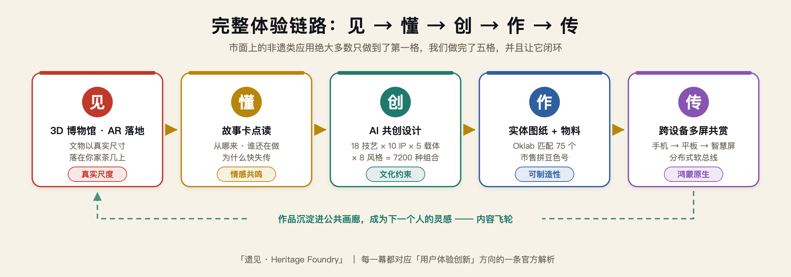
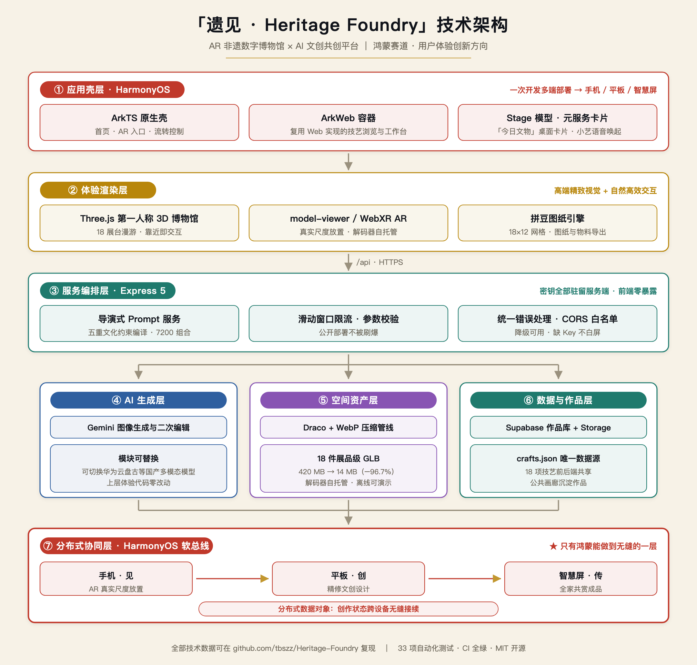

# 遗见 · Heritage Foundry

## 把非遗博物馆，装进每个人的客厅

**第十一届（2026）"中国高校计算机大赛—人工智能创意赛" · 鸿蒙赛道 · 用户体验创新方向**

| 项目 | 内容 |
|---|---|
| 作品名称 | 遗见（英文名 Heritage Foundry，应用内署名"非遗造物局"） |
| 参赛赛道 | 鸿蒙赛道 |
| 作品方向 | **用户体验创新**（四方向中仅选此一项） |
| 一句话创意 | 打开手机，一件真实尺寸的非遗文物落在你家茶几上；三次点选，AI 把它和你喜欢的 IP 变成一张设计图；再一键，它变成周末就能亲手拼出来的实体图纸——**看、懂、创、作、传，一条链走完。** |
| 团队 | 子涵（前端主架构 / 3D 博物馆）· 绵阳（AR 与 3D 资产）· 刘宇轩（申报与产品文档），跨校三人组 |
| 代码仓库 | https://github.com/tbszz/Heritage-Foundry （MIT 开源） |
| 当前状态 | Web 全链路已跑通并开源，33 项自动化测试 + CI 全绿；HarmonyOS 原生壳按复赛节点交付 |

> **本文档遵守规程要求**：主体内容控制在 20 页以内，附录与参考资料不计入总页数；提交版为 PDF，命名 `01-作品说明文档+参赛队伍名称`。附录 A 为符合"不超过 800 字"要求的初赛精简版介绍，可直接复制提交。

---

## 目录

- 一、创意描述：一句话、三句话、一张图
- 二、痛点：非遗与年轻人之间的三重断层
- 三、方案：五幕体验「见 → 懂 → 创 → 作 → 传」
- 四、创新性（对应基础评分 50 分）
- 五、完备度（对应基础评分 20 分）
- 六、技术架构
- 七、前景评估（对应基础评分 20 分）
- 八、实际应用价值（对应附加评分 20 分）
- 九、鸿蒙特性集成清单
- 十、竞品对比与首发性主张
- 十一、团队、分工与三阶段里程碑
- 十二、原创声明
- 附录 A：800 字精简版作品介绍
- 附录 B：评分维度逐项对照表
- 附录 C：数据来源与口径说明
- 附录 D：答辩开场与金句

---

# 一、创意描述：一句话、三句话、一张图

## 一句话

**「遗见」把非遗博物馆装进每个人的客厅——一件文物以真实尺寸落在你的茶几上，AI 陪你把它重新创造一次，再变成你亲手能做出来的实物。**

## 三句话

1. **它是一座 AR 非遗数字博物馆。** 不是网页上的图片墙，而是第一人称走进去的三维空间：推门、漫游、靠近展台、听它讲自己的故事；再一键掏出手机摄像头，让景德镇的瓷瓶以 1:1 真实尺寸站在你家茶几上，你可以绕着它走、蹲下来平视釉面上的每一道笔触。
2. **它是一个 AI 非遗共创引擎。** 18 项非遗技艺 × 10 个流行 IP × 5 种文创载体 × 8 种视觉风格 = **7200 种可组合的创作起点**，每一种组合都被翻译成一段"懂工艺"的导演式提示词，让 AI 生成的不是"泛国风图片"，而是有具体工艺辨识度的文创方案。
3. **它是一条数字通往实体的编译链。** 别人止步于一张好看的图，我们继续往下走：AI 图 → Oklab 感知色差匹配 75 个市售拼豆色号 → 18×12 可施工图纸 + 逐色材料清单 → 周末采购一盒拼豆，屏幕上那件东西就挂在你的包上了。

## 一张图：完整体验链

**图 1　完整体验链路：见 → 懂 → 创 → 作 → 传**

**市面上的非遗类应用，绝大多数只做到了第一格。我们做完了五格，并且让它闭环。**

---

# 二、痛点：非遗与年轻人之间的三重断层

## 2.1 供给端：名录越拉越长，会做的人越来越少

据文化和旅游部公开数据，国务院已公布五批国家级非物质文化遗产代表性项目名录，共 **1557 项**；对应认定的国家级代表性传承人五批累计约 **3000 余人**，认定时平均年龄已超过 **63 岁**。中国列入联合国教科文组织非遗名录（册）的项目数量位居世界第一，达 **44 项**。

名录在增长，能亲手做出这些东西的人在减少。**"人走技失"不是修辞，是每年都在发生的减法。**

## 2.2 需求端：年轻人不是不爱，是够不着

年轻人对传统之美的支付意愿早已被验证——博物馆文创的爆款、马面裙的断货、新中式的持续走热都在说明这件事。缺的从来不是兴趣，而是**一条足够低门槛的路径**：

非遗在博物馆的玻璃展柜里，在县城的作坊里，在纪录片的旁白里——**唯独不在他们每天要摸几十次的手机里，不在他们的客厅茶几上。**

## 2.3 工具端：三道具体的断层

| 断层 | 现状 | 后果 |
|---|---|---|
| **内容断层** | 图文介绍、静态展陈、单向讲解 | 信息完整，但没有参与感，文化转化不成记忆 |
| **创作断层** | 纹样、配色、工艺、寓意都有专业门槛 | 有灵感也止步于"不会画、不会建模、不会打样" |
| **落地断层** | AI 生图工具生成一张图就结束 | 数字内容无法变成能拿在手里的作品 |

## 2.4 我们要反过来做

过去十年，"非遗进校园""非遗展演"做了很多**把人拉到非遗面前**的努力。

我们做的方向恰好相反：**把非遗送到人面前。**

让一个从没去过景德镇的大学生，在自己的出租屋里绕着一只真实尺寸的青花瓷瓶走一圈，看清釉面上的每一道笔触，然后亲手把它变成一件属于自己的东西。

---

# 三、方案：五幕体验「见 → 懂 → 创 → 作 → 传」

官方对用户体验创新方向的定义是"围绕 UI/UX 设计创新，打造兼具**高端精致视觉**与**自然高效交互**的创意作品"。我们把整个产品设计成一场三分钟能演完的五幕剧，每一幕都对着这句话打磨。

## 幕一 · 见｜文物走出展柜（已实现）

启动应用，你不是看到一个列表页，而是**站在一座朱红宫门前**。

一块牌匾在暗场中缓缓亮起；滚轮向前或点击，红门旋开，视场角从 55° 猛推到 78° 再收回 55°——一次刻意设计的**冲刺进门冲击感**，让人真的觉得自己走进去了。门内是一条祥云暗纹的长廊，朱红织金地毯延伸向深处，两侧 **18 座石质展台**上悬浮着 18 件非遗展品的三维模型，缓慢自转。

WASD 或拖拽自由环视行走。这不是"3D 效果"，这是**第一人称空间导航**——官方方向解析第 3 条要求的"融合三维空间感的 UI 设计"，我们把整个首页都做成了三维空间本身。

然后是关键一跳：点击「带它回家」，摄像头开启，**那只瓷瓶以真实物理尺寸落在你家茶几上**。绕着它走，蹲下来平视它——像在博物馆里一样，只是没有那层玻璃。

## 幕二 · 懂｜点读文化卡片（已实现）

靠近任意展台，按 E，一张故事卡轻轻浮起。

这项技艺从哪里来、谁还在做、为什么快要失传。18 项技艺**每一项都配有完整故事文本、文化寓意、地域流派差异与主题色**——例如布老虎的卡片会讲到"起源于上古虎图腾崇拜，端午佩戴以佑平安，陕西粗犷质朴、山东细腻精巧"。

文案克制，一屏讲完，不堆术语。**先让人对"物"动心，再让人对"事"上心。** 这是官方方向解析第 2 条所说的"融合文化认同、情感共鸣等主观感受的体验创新"。

## 幕三 · 创｜AI 共创设计（已实现）

不用离开博物馆。就在展台卡片里，选四样东西：

- **一项非遗技艺**（苗绣 / 云锦 / 唐卡 / 皮影……18 选 1）
- **一个流行 IP**（哪吒 / 孙悟空 / 哆啦A梦 / 皮卡丘……10 选 1）
- **一种文创载体**（帆布包 / 手机壳 / 冰箱贴 / 贴纸 / 拼豆挂件，5 选 1）
- **一种视觉风格**（国潮 / 海报 / 产品 / 复古 / 极简 / 节庆……8 选 1）

点击生成。数秒后 AI 设计图产出，可继续做基于原图的二次编辑，也可实时贴到 3D 载体上拖动旋转端详。

**关键差异在于：这不是一个裸的输入框。** 每次点选背后是一段服务端构造的**导演式提示词**——技艺的视觉语言、工艺的超现实转译方向、IP 的可识别特征、载体的产品约束、风格的画面调性，五重约束同时施加，最后还加一条"拼豆可读性"约束反向锁定下游可制造性。

**AI 生成有边界、有文化准确性，而不是开盲盒。**

## 幕四 · 作｜图纸变成实物（已实现，独家）

对设计满意后，一键生成拼豆图纸。这是全链路上**"数字变实体"的关键一跳**，也是我们目前在同类产品中未见的能力：

1. 图像按 **18×12 = 216 格**网格化采样，每格支持"主色投票"与"均值"双模式；
2. 每格代表色经 **sRGB → 线性 → Oklab 感知均匀色彩空间**转换，在 **75 个真实市售拼豆色号**中做感知色差最近邻匹配（带缓存，避免重复运算）；
3. 支持 **MARD / COCO / 漫漫 / 盼盼 / 咪小窝五大色号体系**切换——买得到的色号，而不是理论上的颜色；
4. **洪水填充算法**从图纸四边向内扩散，自动剔除外部背景，只留下真正要拼的主体轮廓；
5. 输出带坐标轴刻度、色号标注的高清图纸 PNG + 逐色数量清单 CSV，并自动估算**豆数、色数、耗时与难度等级**。

屏幕上那个图案，周末采购一盒拼豆就能拼出来，挂在自己的包上。

**这就是官方方向解析第 5 条"兼顾功能、体验、外观与可制造性的工业设计创新"——我们把可制造性写进了算法。**

## 幕五 · 传｜多设备共赏（HarmonyOS 原生能力，复赛交付）

手机上 AR 看到一半，一键**流转到平板**继续精修设计——进度、参数、模型状态无缝接续；完成后**投上智慧屏**，全家围坐一起看，奶奶认出了她年轻时绣过的纹样。

这一幕不是功能演示，是情感场景。**而它只能发生在鸿蒙上**——理由见第四章 4.5 节。

## 视觉语言

整体沿用**朱砂红 #d3382f、孔雀绿 #1f7a6d、鎏金黄 #c99a2e、靛青蓝 #2f5f9f** 的国潮色系，以深墨与瓷白平衡。场景质感由 **11 张 AI 生成的无缝贴图**支撑：金缝石材地板、祥云暗纹墙面、朱红织金地毯、青砖门楼、漆面木梁、凤凰金剪影壁、藻井天花……全部脚本可重复生成。

动效只服务于注意力与反馈（生成中脉冲、图纸扫描线入场），支持 `prefers-reduced-motion`，关键操作全程状态可循。**精致但不喧哗，炫酷但不失控。**

---

# 四、创新性（对应基础评分 50 分）

> 规程说明：创新性 50 分 = 鸿蒙技术创新性 + 产品创意 + 交互创新 + 技术创新。以下逐维度展开。

## 4.1 产品创意：从"展示非遗"跃迁到"生产新的非遗表达"

这是本项目最根本的一次范式转换。

绝大多数非遗数字化项目的隐含假设是——**非遗是需要被保存的遗产**，所以做的是数字化档案、线上展厅、VR 全景。这些都对，但它们把用户永远放在观众席上。

我们的假设不同：**非遗真正的危机不是"没人知道"，而是年轻人知道之后，仍然不知道如何靠近、如何参与、如何把它带回自己的生活。**

所以我们不做又一座玻璃展柜，我们做一台**文化创造引擎**：

> **不要只让年轻人观看传统，而要把创造传统的工具交到他们手中。**

在「遗见」里，用户不是浏览者，是设计者。每一次生成都是一次新的非遗表达被生产出来，被保存进公共画廊，成为下一个人的灵感。**文化不再只是被检索的信息，而成为一种可以被调用、被组合、被制作的创作能力。**

## 4.2 交互创新：把首页做成一个可以走进去的三维空间

传统 Web 首页的交互隐喻是"滚动的纸"。我们换成了"可以走进去的建筑"。

| 交互设计 | 实现要点 | 为什么创新 |
|---|---|---|
| **牌匾开场 → 冲刺进门** | 滚轮/点击触发红门旋开 + FOV 55→78→55 三段缓动 | 用镜头语言而非页面切换完成"进入"的仪式感，把加载等待变成叙事 |
| **第一人称自由漫游** | WASD 键盘 + 拖拽环视，展台几何体共享实例 | 空间记忆代替菜单记忆——用户记住的是"左手第三个展台"，不是"分类筛选第三项" |
| **靠近即交互（E 键唤出）** | 距离阈值触发展台卡片，创造流程内嵌 | 不打断沉浸：从"看展品"到"改展品"零跳页，创作发生在空间里 |
| **AR 真实尺度放置** | `<model-viewer>` + WebXR / Scene Viewer，真实物理尺寸 | 尺度感是文物理解的一部分——照片永远给不了"它其实这么大"这个认知 |
| **性能即体验** | shader 预编译、纹理预上传、进场前模型预热、消除逐帧 Vector3 分配 | 进场动画不因首次编译/解码卡顿。**流畅本身就是精致视觉的一部分** |

最后一条尤其想请评委注意：我们不是"做完效果就交"，而是**专门做过一轮进场卡顿的攻坚**——把 shader 编译、纹理上传、模型解码全部前移到进场动画之前，并消除渲染循环里的每帧内存分配。这是"自然高效交互"的工程解释。

## 4.3 技术创新之一：文化约束的生成引擎，而不是又一个 prompt 输入框

通用 AI 生图的问题不是画得不好，而是**画得不对**——它能画出很"中国风"的图，但画不出"这是苗绣而不是湘绣"。

我们的解法是把工艺知识**结构化成可以进入生成过程的设计基因**。18 项技艺，每一项都被拆解为一组视觉语言与一条超现实转译方向：

| 技艺 | 视觉语言（进入 prompt 的设计基因） | 转译方向 |
|---|---|---|
| 苗绣 | 密集针脚、银饰反光、蝴蝶妈妈纹、几何彩线 | 让角色被苗银与彩线重新绣一遍 |
| 南京云锦 | 金线织锦、团花纹、皇家织造光泽、层叠纹样 | 让角色成为织进云锦的皇家纹样 |
| 布老虎 | 虎头纹样、五毒刺绣、粗棉布肌理、民间艳彩撞色 | 让角色变成威风又憨态的镇宅布老虎守护神 |

服务端把五重约束编译成一段完整的导演指令：**核心任务 + 跨界组合 + 非遗视觉语言 + IP 可识别特征（并显式规避官方 logo 与文字商标）+ 载体产品约束 + 风格调性 + 拼豆可读性反向约束 + 画面规格**。

**18 × 10 × 5 × 8 = 7200 种组合，每一种都有文化上站得住的生成边界。** 这是一座"传统工艺 ↔ 当代审美"的实时翻译器：传统不必迎合潮流，而是获得一种与当代对话的新语法。

## 4.4 技术创新之二：一个把像素编译成实物的编译器

这是我们最硬的一块技术差异，也是最容易被低估的一块。

把一张 AI 图变成"能买到色号、能照着拼出来"的图纸，看起来像下采样，实际上是四个真实的技术问题：

**问题一：RGB 空间的"最近颜色"不是人眼的最近颜色。**
在 RGB 里算欧氏距离，会把感知上差很远的两个颜色判为接近。我们把每格代表色转到 **Oklab 感知均匀色彩空间**再算色差——这是目前工业界公认在感知均匀性上优于 CIELAB 的方案。并且做了色彩转换缓存，216 格逐格转换不成为性能瓶颈。

**问题二：色号必须是买得到的。**
我们没有用理论调色板，而是录入了 **75 个真实市售拼豆色号**，并支持 **MARD / COCO / 漫漫 / 盼盼 / 咪小窝** 五大主流体系切换。用户拿着图纸去下单，色号能对上。

**问题三：采样策略决定图纸能不能看。**
均值采样会把高对比边缘糊成灰泥。我们提供"主色投票"（按 8 级色桶统计格内主色）与"均值"双模式，默认主色——保住轮廓的锐度。

**问题四：背景必须被识别为"不拼"，而不是"拼成白色"。**
我们用**洪水填充**从图纸四边向内扩散，把连通的近纸色区域标记为"外部背景"。结果是图纸上只剩真正要拼的主体，材料清单里不会出现一百多颗白豆。

输出物：带双向坐标轴刻度与色号标注的高清 PNG 图纸、逐色数量 CSV 清单、豆数/色数/耗时/难度四项自动估算。

**从"好看的一张图"到"周末的一件作品"，这中间的一公里是我们自己铺的路。**

## 4.5 鸿蒙技术创新：为什么这个体验必须发生在 HarmonyOS 上

我们不是"顺便适配鸿蒙"。我们有一个真实痛点**只有鸿蒙能解**。

**AR 观赏与共创，天然需要多块屏幕接力：**

| 环节 | 最合适的设备 | 为什么 |
|---|---|---|
| 把文物"放"进房间 | **手机** | 只有手机能被随手举起来、绕着走、蹲下去 |
| 精修文创设计 | **平板** | 手机屏太小做不了精细设计，平板有笔有面积 |
| 全家共赏成品 | **智慧屏** | 分享是这个体验的情感终点，客厅大屏才是舞台 |

这条设备接力链，在其他平台上是**断裂的**——你得导出、传文件、重新打开、重新定位进度。在鸿蒙的分布式体系里，它是**原生的、无缝的**。

**逐条对应官方特性：**

1. **跨设备流转（分布式软总线 + 分布式数据对象）**——手机 AR 看到一半，一键流转到平板继续文创设计，进度、参数、模型状态、生成历史无缝接续。这是我们故事线的第五幕，也是整个产品的情感高潮。
2. **元服务卡片「今日文物」**——桌面卡片每天推送一件文物与一句故事，用户不必打开应用即可轻量触达非遗。**把"每天见一面"变成习惯**，这是非遗传播真正需要的东西：不是一次爆款，而是日常在场。
3. **小艺语音唤起**——"小艺小艺，看看苗绣"，语音直达 AR 观赏。客厅场景下，手上可能拿着孩子、拿着茶杯，语音才是自然高效的交互。
4. **一次开发多端部署（ArkTS + ArkWeb 混合架构）**——同一套工程覆盖手机（见与作）、平板（创）、智慧屏（传）。**三种屏幕三种角色**，正是"一次开发多端部署"设计理念最具体的一次演绎：不是同一个界面拉伸三次，而是同一份能力在三块屏上各司其职。
5. **HarmonyOS AR 能力演进路径**——初赛/复赛阶段走 `<model-viewer>` / WebXR 经 ArkWeb 承载（保证可演示、可离线），决赛阶段评估华为 AR Engine 原生方案作为体验升级路径。

**已集成/规划的鸿蒙特性数量达 5 项，超过官方"建议 3 个以上"的要求。** 详细的已实现/在建/规划分级见第九章。

## 4.6 工业设计创新：把可制造性写进算法

官方方向解析第 5 条要求"兼顾功能、体验、外观与可制造性的工业设计创新"。这一条通常被理解为"做个好看的硬件外观"，我们给出的是另一种回答：

**我们让可制造性成为生成过程的一个约束条件，而不是事后的检查项。**

- 在 AI 生成阶段就注入"拼豆转译约束"：单个主体居中、粗轮廓、高对比色块、颜色数量克制、细节可被 18×12 图纸读取、边缘不要过碎；
- 在载体维度注入产品约束：手机壳要竖向主视觉且主体不贴边，帆布包要边缘完整适合印刷与刺绣贴片，冰箱贴要厚实小物件感；
- 在输出阶段给出真实的材料清单与工时估算，让"做不做得出来、要多久、要买什么"在设计的第一秒就有答案。

**这是从设计端就锁定生产端的正向工程思路，而不是把不可制造的漂亮图丢给用户。**

## 4.7 五个最值得记住的创新点

| # | 创新点 | 一句话 |
|---|---|---|
| 01 | **范式转换** | 不是展示非遗，而是生产新的非遗表达——用户从观众变成设计者 |
| 02 | **完整链路** | 市面 AR 博物馆止步于"看"，我们走完「见→懂→创→作→传」全程 |
| 03 | **实体编译器** | Oklab 感知色差 + 75 真实色号 + 洪水填充抠底，把像素编译成能拼出来的实物 |
| 04 | **文化约束生成** | 7200 种组合，每种都有工艺辨识度，AI 生成有边界而不是开盲盒 |
| 05 | **鸿蒙原生刚需** | 多屏创作接力是体验本体而非附加功能，只有分布式软总线能做到无缝 |

---

# 五、完备度（对应基础评分 20 分）

> 规程说明：完备度 20 分 = 功能完备度 + 体验完整顺畅。我们的回答是：**这不是 PPT，是一个已经跑起来、开源、有测试、能部署的产品。**

## 5.1 五步闭环全部跑通（可现场演示）

| 步骤 | ① 技艺浏览 | ② AI 生成设计图 | ③ 3D 载体实时贴图 | ④ 拼豆图纸 + 材料清单 | ⑤ 作品保存 |
|---|:---:|:---:|:---:|:---:|:---:|
| 状态 | ● 已跑通 | ● 已跑通 | ● 已跑通 | ● 已跑通 | ● 已跑通 |

外加两条已上线的能力：**AR 真实尺度放置**（`ar.html`，安卓/鸿蒙浏览器可用）与**第一人称 3D 博物馆首页**（`MuseumScene.js`，进门/行走/环视/展台卡片/图纸生成全链路已通过无头 Chrome 实测）。

## 5.2 内容资产已全部就位（不是占位符）

| 资产 | 数量与完备度 |
|---|---|
| 非遗技艺结构化数据 | **18 项**，横跨传统美术、刺绣、印染、陶瓷、织锦、雕刻、书法、篆刻、戏剧、技艺等 **14 个门类** |
| 每项技艺的完整字段 | 故事文本、文化寓意、简介、博物馆解说词、主题色、emoji、3D 模型、AI 提示词语言、转译方向 —— **18/18 全部齐备，无一项缺失** |
| 展品级 3D 模型 | **18 件** GLB，Git LFS 管理原始资产 |
| 场景贴图 | **11 张** AI 生成无缝贴图，脚本可重复生成 |
| 技艺图标 | **18 张** AI 生成图标，已转 WebP |
| 拼豆色号库 | **75 个**真实市售色号 × **5 个**主流色号体系 |
| 提示词组合空间 | **7200 种**（18 技艺 × 10 IP × 5 载体 × 8 风格） |

覆盖的技艺清单：布老虎、剪纸、皮影、苗绣、扎染、景德镇陶瓷、中国书法、中国篆刻、南京云锦、泥塑、制茶技艺、风筝、花灯、木雕、石刻、木版年画、唐卡、玉雕。

## 5.3 工程化：我们认真解决了"能不能上线"的问题

这一节想证明的是：**团队不只会做能演示的概念，也在解决真实 Web 产品的交付问题。**

**性能与资产管线（真实压缩数据，脚本可复现）**

| 项 | 优化前 | 优化后 | 压缩率 |
|---|---|---|---|
| 展品 3D 模型（Draco 几何压缩 + WebP 纹理） | **420 MB** | **14 MB** | **-96.7%** |
| 首屏字体（fonttools 子集化 → woff2） | **71 MB** | **1.7 MB** | **-97.6%** |
| 首屏总下载量（分包 + 懒加载 + 空闲预取） | ~90 MB | **< 5 MB** | **-94%** |

两条管线都是可重复运行的脚本（`scripts/compress-models.mjs`、`scripts/subset_fonts.py`），改了源资产重跑即可，不是一次性手工优化。

**安全与稳定性**

- 生图 API 加**滑动窗口限流**（内存实现，附明确的多实例升级说明），公开部署不会被刷爆；
- **CORS 白名单**可配置，统一错误处理中间件，错误分类清晰；
- 所有密钥与服务地址保留在**服务端**，前端零密钥暴露；
- **降级可用**：未配置 Gemini 或 Supabase 时服务照常启动并返回明确提示——**演示现场断网/缺 key 也不会白屏**；
- Draco 解码器与 model-viewer 全部**自托管**，不依赖任何 CDN，**离线可完整演示**。

**测试与交付**

- **33 项自动化测试 / 13 个测试文件**（Vitest + Supertest），覆盖路由、限流、Gemini 服务、Supabase 服务与存储、提示词构造、图纸生成、博物馆布局、首页渲染、URL 参数同步等；
- **GitHub Actions CI**：push / PR 自动跑测试 + 构建；
- **三种部署方式**：单进程（Express 直接托管 `dist/`）、Docker 多阶段构建（已本地构建运行验证，页面/模型/API 全通）、Vercel；
- 数据库迁移文件随仓库提供，`supabase/migrations/` 可一键应用；
- MIT 开源，含 3D 模型资产使用附注。

**数据层治理**

`src/data/crafts.json` 是**唯一数据源**，前后端共享。项目早期存在四处硬编码技艺数据的漂移风险，已全部派生化并做**逐字节等价验证**——改一处，全站生效。

## 5.4 体验的顺畅：我们专门打过一场性能攻坚

3D 场景最容易死在"第一次进场卡顿"上。我们做了五件事：

1. **shader 预编译**——进场前编译完所有材质，避免首帧编译停顿；
2. **纹理预上传**——贴图提前上传 GPU，避免行走中突然掉帧；
3. **模型预热**——进场动画前解码完所有 GLB；
4. **展台几何体共享**——18 座展台共用一份几何体与材质实例；
5. **消除逐帧内存分配**——渲染循环里不再新建 `Vector3`。

结果：**进场动画不再因首次编译/解码卡顿。** 这一条不写在功能列表里，但它决定了评委按下鼠标的第一秒对这个作品的判断。

---

# 六、技术架构

整体七层，自上而下：**应用壳层 → 体验渲染层 → 服务编排层 →（AI 生成层 · 空间资产层 · 数据与作品层）→ 分布式协同层**。

**图 2　「遗见 · Heritage Foundry」七层技术架构**

> 矢量源文件：`docs/初赛材料/figures/架构图.svg`（可无损缩放、可调配色，用于最终 PDF 排版）；生成脚本可重复运行，架构调整后重出图即可。

## 技术栈

| 层级 | 技术选型 |
|---|---|
| 鸿蒙应用壳 | ArkTS、ArkWeb、Stage 模型、分布式软总线（复赛交付） |
| 前端 | Vite 6、原生 ES Modules 多页应用、CSS Variables |
| 3D / 空间交互 | Three.js 0.160、`<model-viewer>`、WebXR / Scene Viewer、Tween.js |
| 后端 | Node.js、Express 5 |
| AI 生成 | Google Gemini 图像接口（`@google/genai`），**AI 层为可替换模块** |
| 数据与对象存储 | Supabase（Postgres + Storage），迁移文件随仓库提供 |
| 色彩算法 | 自研 Oklab 感知色差匹配 + 洪水填充背景剔除 |
| 测试 | Vitest 4 + Supertest（33 项测试 / 13 文件） |
| 工程化 | Docker 多阶段构建、GitHub Actions CI、Vercel、Git LFS、MIT |
| 资产管线 | glTF-Transform + Draco3D、sharp（WebP）、fonttools（子集化） |

**关于 AI 层可替换性的说明**：Gemini 图像能力被封装在独立的 `geminiService` 中，上层只依赖统一的生成/编辑接口。这意味着切换到华为云盘古等国产多模态模型时，**不影响上层任何体验代码**——这是我们为鸿蒙生态与国产化路径预留的架构空间。

---

# 七、前景评估（对应基础评分 20 分）

> 规程说明：前景评估 20 分 = 需求真实性 + 社会价值 + 可落地业价值。

## 7.1 需求真实性：三类真实存在预算的用户

我们没有臆想用户。以下三类场景都有真实的、已经在花钱的需求：

**① 学校的美育与研学课程**——"非遗进校园"是教育部门的持续性任务，学校每年都要采购课程与活动。现状是老师自己找资料、印图片、买材料，一堂课备三天。「遗见」给出的是：学生自己完成"选技艺 → 做设计 → 讲故事 → 拼成品"的项目式学习，一次生成即对应文化研究、视觉设计、数字技术、手工实践、口头表达五维能力，成果可直接办班级展。**它天然是可课程化的。**

**② 博物馆、非遗馆与文旅景区的互动展项**——场馆每年有明确的数字化展陈预算，痛点是"观众看完即走、没有留存、没有传播"。「遗见」把它变成"带着自己的创作离开"：扫码入场，把馆藏元素变成个性化文创方案，AR 预览，图纸带走，社交分享。**观众离场时手里有东西，朋友圈里有内容。**

**③ 文创品牌的早期灵感验证**——文创设计的成本大头在早期试错。品牌可以在几分钟内探索"这项技艺 × 这个 IP × 这个载体 × 这个风格"的上百种候选方向，在进入设计深化与实体打样前就收敛方向。**它压缩的是文创产业链最贵的那一段。**

外加第四类长尾用户：**非遗传承人与年轻设计师**。前者需要有人帮他把手上的视觉语言整理成可传播的形态，后者需要在尊重工艺特征的前提下找到当代表达。「遗见」对两端都是数字助手。

## 7.2 社会价值：让非遗从"被保护"走向"可持续参与"

保护非遗的终极目标，不是让它保持静止。

**是让它仍然有人理解、有人使用、有人愿意继续创造。**

一项技艺真正的死亡，不是最后一个传承人离开的那天，而是再也没有人产生"我想试试"这个念头的那天。「遗见」要做的，就是把"我想试试"的门槛降到一次点击——用年轻人最熟悉的 AI、3D 与 AR 交互，降低第一次接触和第一次创作的成本。

**当非遗从"只能观看"变成"人人可创作"，传承才真正拥有了下一代。**

## 7.3 可落地的业务模式：五级阶梯

平台价值随内容与作品数据积累而复利增长，可形成模块化的商业能力：

| 层级 | 对象 | 形态 | 商业逻辑 |
|---|---|---|---|
| L1 免费创作入口 | 公众 | 免费 Web / 鸿蒙元服务 | 获客与内容飞轮，作品沉淀进公共画廊 |
| L2 教育版 | 学校 | 课程包 + 班级作品空间 + 教师后台 | 按校/按学期订阅，配套材料包分销 |
| L3 场馆定制 | 博物馆 / 非遗馆 / 景区 | 主题定制互动展项，一地一馆一技一故事 | 项目制交付 + 年度维护 |
| L4 品牌工作台 | 文创品牌 / 设计机构 | 多人协作、方案管理、API 服务 | SaaS 订阅 + 按调用计费 |
| L5 区域文化基础设施 | 地方文旅 | 地域非遗数字资产库 + 共创平台 | 政府/文旅数字化项目 |

**材料包分销是被低估的一条真实变现路径**：我们输出的是精确到色号与数量的材料清单——这本身就是一张购物车。图纸生成完成的那一秒，就是最高的购买意愿时刻。

## 7.4 增长的复利：为什么这个平台会越用越强

- 技艺库每增加一项，组合空间乘性增长（当前 7200 种，加一项技艺即 +400 种）；
- 每个用户的作品都进入公共画廊，成为下一个用户的灵感与社会证明；
- 每个地区接入自己的非遗内容，就多一个本地化入口与本地流量；
- 传承人参与内容共建，则文化准确性与权威性同步提升。

**这不是一个功能型工具，而是一座会自己长大的文化基础设施。**

## 7.5 风险与我们的应对（我们不回避）

| 风险 | 应对 |
|---|---|
| IP 授权合规 | 提示词已显式规避官方 logo 与文字商标；中期建立作品授权、内容审核与 IP 合规机制，商业版切换为自有/授权 IP 库 |
| AI 生成的文化准确性 | 已用结构化工艺语言约束生成边界；中期邀请传承人参与提示词语料与内容审核共建 |
| AI 调用成本 | 已上线限流；AI 层可替换设计允许切换到成本可控的国产模型或端侧推理 |
| 大资产加载 | 已完成 -96.7% / -97.6% 两条压缩管线与首屏分包，首屏 < 5MB |

---

# 八、实际应用价值（对应附加评分 20 分）

> 规程说明：附加评分 20 分 = 实际可演示的 HAP 文件 / 源代码文件 / 演示系统、作品上架，附加评分越高。

## 8.1 我们现在就能交出来的东西

| 提交物 | 状态 |
|---|---|
| **完整源代码** | ● 已开源（MIT），https://github.com/tbszz/Heritage-Foundry ，含全部工程文件、可复现构建 |
| **可运行演示系统** | ● `npm install && npm run start` 即跑；或 `docker build && docker run` 一键起（已本地验证页面/模型/API 全通） |
| **离线演示能力** | ● 解码器与 model-viewer 自托管，缺 key / 断网不白屏，降级提示明确 |
| **自动化测试报告** | ● 33 项测试 / 13 文件全绿，CI 可复验 |
| **AR 真机可演示** | ● 安卓 / 鸿蒙浏览器打开 `ar.html` 即可把文物以真实尺寸放进房间 |
| **API 文档** | ● `docs/API.md` |
| **数据库迁移** | ● `supabase/migrations/` 可一键应用 |
| 公网演示链接 | ◎ 部署中，提交前补充 |
| 演示视频（5 分钟内） | ◎ 含 15 秒 AR 实拍片段 |
| HarmonyOS HAP | ○ 复赛节点交付（9 月） |

## 8.2 落地就绪度的一句话总结

**这个项目现在克隆下来、装依赖、跑起来，五分钟内就能看到文物在你的房间里。** 不需要我们到场，不需要特殊环境，不需要"这部分还没做完请想象一下"。

## 8.3 答辩现场我们想做的一件事

**让评委老师亲手拿起自己的手机，扫一个码，把一件国家级非遗文物放在答辩席的讲台上。**

我们所有的性能优化、离线自托管、真实尺度校准，都是为了让这一件事在现场万无一失。

---

# 九、鸿蒙特性集成清单

> 官方建议"集成 3 个以上鸿蒙特性"。我们规划 5 项，并诚实标注每一项的当前状态。

| # | 鸿蒙特性 | 在「遗见」中的作用 | 状态 | 交付节点 |
|---|---|---|---|---|
| 1 | **ArkTS + ArkWeb 混合架构**（一次开发多端部署） | 原生壳承载首页、AR 入口与流转控制；Web 实现经 ArkWeb 复用。同一工程覆盖手机/平板/智慧屏，三屏三角色 | ◎ 在建 | 复赛（9 月） |
| 2 | **分布式软总线 + 分布式数据对象**（跨设备流转） | **第五幕的底座**：手机 AR → 平板精修 → 智慧屏共赏，进度/参数/模型状态无缝接续 | ◎ 在建 | 复赛（9 月） |
| 3 | **元服务卡片** | 「今日文物」桌面卡片，每天一件文物一句故事，不打开应用即可触达非遗，把"每天见一面"变成习惯 | ○ 规划 | 决赛（10–11 月） |
| 4 | **小艺语音唤起** | "小艺小艺，看看苗绣"直达 AR 观赏，适配客厅场景下双手不空闲的自然交互 | ○ 规划 | 决赛（10–11 月） |
| 5 | **AR 能力（WebXR → AR Engine）** | 真实尺度文物放置。当前经 ArkWeb 承载 `<model-viewer>` 保证可演示可离线；决赛评估 AR Engine 原生方案作为体验升级 | ● Web 路线已实现　/　○ 原生路线评估中 | 已可演示 / 决赛升级 |

**架构上的关键决策**：AI 层与 AR 层都被设计为**可替换模块**。这不只是工程洁癖——它意味着「遗见」的上层体验可以在不重写任何一行交互代码的前提下，逐步迁移到华为云盘古、AR Engine 等鸿蒙原生与国产化方案上。**我们为鸿蒙生态预留了完整的演进通道。**

---

# 十、竞品对比与首发性主张

## 10.1 横向对比

| 能力维度 | 普通非遗展示网站 | 通用 AI 生图工具 | 市面 AR 博物馆应用 | **遗见 Heritage Foundry** |
|---|:---:|:---:|:---:|:---:|
| 非遗知识与故事 | ● | △ | ● | **●** |
| 三维空间感 UI（可走进去） | ○ | ○ | △ | **●** |
| AR 真实尺度放置 | ○ | ○ | ● | **●** |
| 工艺视觉语言约束生成 | ○ | △ | ○ | **●** |
| 非遗 × 流行 IP 共创 | ○ | ● | ○ | **●** |
| AI 图像生成与二次编辑 | ○ | ● | ○ | **●** |
| 3D 载体实时贴图预览 | ○ | ○ | △ | **●** |
| **可施工实体图纸 + 材料清单** | ○ | ○ | ○ | **● 独家** |
| 感知色差色号匹配（Oklab） | ○ | ○ | ○ | **● 独家** |
| 跨设备创作接力 | ○ | ○ | ○ | **●** |
| 作品沉淀与公共画廊 | △ | △ | ○ | **●** |
| 教育 / 场馆 / 文创全场景延展 | △ | △ | △ | **●** |

> 图例：● 具备　△ 部分具备　○ 不具备

**「遗见」的优势不在某一个孤立功能，而在于它把文化内容、生成式 AI、三维资产、空间交互、实体制造与多设备协同组织成了一个完整闭环。** 竞品可以复制其中任意一格，但复制不了这条链。

## 10.2 首发性主张

> 规程说明：特等奖须为**鸿蒙首发应用或首发创新特性**，若无可空缺。

我们据此提出两项首发性主张：

**主张一 · 鸿蒙首发应用类型**：据我们的调研，鸿蒙生态内尚无「AR 真实尺度非遗观赏 + AI 文化约束共创 + 可施工实体图纸输出」三者贯通的应用。「遗见」申报为该类型的鸿蒙首发应用。

**主张二 · 首发创新特性**：**"跨设备创作接力"（Cross-Device Creative Relay）**——把一次创作行为按设备能力拆解为「手机观赏 → 平板创作 → 大屏共赏」三段，并通过分布式数据对象保持创作状态连续。据我们的调研，这一交互范式在鸿蒙生态的文化创意类应用中尚未出现。

我们愿意在答辩现场以实机演示接受对上述两项主张的检验。

---

# 十一、团队、分工与三阶段里程碑

## 11.1 团队（三人，跨校组队，符合规程人数上限）

| 成员 | 职责 | 已交付 |
|---|---|---|
| 子涵（tbszz） | 前端主架构、项目统筹 | 第一人称 3D 博物馆首页、创造流程组件化、性能攻坚、资产管线、部署工程化 |
| 绵阳（orionsheep） | AR 与 3D 技术、模型资产 | model-viewer AR POC、3D 模型资源、AR 实拍演示 |
| 刘宇轩（Ltdaaa） | 申报文档、赛事跟踪 | 创意书与作品说明文档、赛事信息与线上支持 |

指导教师：按规程要求由队长所属高校正式教师担任，晋级复赛时提交盖章报名表。

## 11.2 三阶段里程碑（每阶段一个主题、一条验收标准）

**初赛 · 主题「能跑」（已完成，7 月）**

- ● 五步闭环跑通、AR 页上线、第一人称 3D 博物馆首页上线
- ● 性能：模型 -96.7%、字体 -97.6%、首屏 < 5MB
- ● 工程：限流 + CORS + Docker + CI + 33 项测试 + MIT 开源
- **验收标准：手机扫码，10 秒内文物出现在桌面上。** ● 已达成

**复赛 · 主题「鸿蒙」（9 月 30 日前，留一周缓冲）**

- ArkTS 原生壳 + ArkWeb 混合应用在 DevEco Studio 可编译运行，产出可安装 HAP
- 跨设备流转（手机 → 平板 → 智慧屏）演示一镜到底
- 公网正式演示链接 + 5 分钟演示视频
- **验收标准：手机上看到一半的 AR，在平板上无缝接着改。**

**决赛 · 主题「惊艳」（10–11 月）**

- 评估并落地 AR Engine 原生方案
- 补齐元服务卡片「今日文物」与小艺语音唤起
- 引入更多国家级与地域性非遗项目，邀请传承人参与内容共建
- **验收标准：让评委亲手用自己的手机，把一件文物放在答辩讲台上。**

## 11.3 长期愿景

我们希望未来**每一种非遗技艺，都拥有可理解的知识档案、可调用的设计语言、可交互的三维资产，和一个还在创作的社区。**

**让非遗不只属于过去，也成为未来内容产业的灵感源代码。**

---

# 十二、原创声明

1. 本作品的核心创意与主要开发过程均由参赛队伍在大赛期间独立完成，代码全部开源可查（https://github.com/tbszz/Heritage-Foundry ，提交历史完整可追溯）。
2. 本作品未与其他同类同级别赛事已获奖作品存在高度雷同；文中提出的实体图纸编译链路、文化约束生成引擎与跨设备创作接力范式均为本队原创设计。
3. 参赛队伍仅报名本赛道本赛题，队员未同时参与其他参赛队伍，符合规程要求。
4. 第三方开源组件（Three.js、model-viewer、Draco、Express、Vite 等）均遵循其原始许可证使用并在仓库中声明；3D 模型资产的使用限制已在 LICENSE 附注中说明。
5. 提示词工程中已显式规避官方 logo 与文字商标，作品内容不含不健康、淫秽、色情或毁谤第三方的内容。
6. 队伍愿意接受竞赛公示期内所有参赛与非参赛人员的监督。

---
---

# 附录 A：800 字精简版作品介绍（初赛第 3 项可直接提交）

> 规程要求"作品介绍文档"不超过 800 字，含创意背景（行业痛点与用户需求分析）、核心功能设计（交互逻辑与技术实现路径）、市场前景评估。以下版本实测汉字 727 个、计入数字与英文约 770 字，**留有安全余量**；如需再压缩，优先删「技术实现」段的工程数字。

**【创意背景】** 国家级非遗代表性项目已达 1557 项，而对应传承人仅 3000 余人、认定时平均年龄超 63 岁，"人走技失"每年都在发生。另一端，年轻人并非不爱传统——博物馆文创与新中式服饰的持续走热已经证明支付意愿存在。真正的断层是路径：非遗在展柜里、作坊里、纪录片里，唯独不在年轻人每天摸几十次的手机里。过去十年做的是"把人拉到非遗面前"，我们要做的恰好相反——**把非遗送到人面前**。

**【核心功能设计】**「遗见」是基于 HarmonyOS 的 AR 非遗数字博物馆与 AI 共创平台，交互逻辑是一条五幕链路：

**见**——启动即站在朱红宫门前，推门进入第一人称三维博物馆，WASD 自由漫游，18 座展台悬浮 18 件非遗展品；一键开启摄像头，文物以 1:1 真实尺寸落在你家茶几上，可环绕、可平视细看。**懂**——靠近展台按 E，故事卡浮起，讲清这项技艺从哪来、谁还在做、为什么快失传。**创**——选一项技艺、一个流行 IP、一种载体、一种风格（18×10×5×8＝7200 种组合），服务端把工艺视觉语言、IP 特征、载体约束、风格调性编译成导演式提示词，AI 生成的是有工艺辨识度的文创方案而非泛国风图片，并可实时贴到 3D 载体上端详。**作**——一键把设计图编译成实体图纸：18×12 网格采样，经 Oklab 感知均匀色彩空间在 75 个真实市售拼豆色号中做感知色差匹配，洪水填充自动剔除背景，输出带坐标刻度的图纸与逐色材料清单——周末买一盒拼豆就能做出来。**传**——基于鸿蒙分布式软总线，手机看、平板创、智慧屏全家共赏，创作状态跨设备无缝接续；配合元服务卡片「今日文物」与小艺语音唤起，把非遗变成日常在场。

技术实现：Three.js + WebXR 渲染层、Express 5 编排层、Gemini 生成层（模块可替换为国产模型）、Supabase 数据层、ArkTS+ArkWeb 应用壳。工程侧已落地 Draco+WebP 模型压缩（420MB→14MB）、字体子集化（71MB→1.7MB）、首屏 <5MB、API 限流、Docker+CI、33 项自动化测试，MIT 开源，离线可演示。

**【市场前景】** 三类需求已有真实预算：学校美育与研学课程（项目式学习成果可直接办展）、博物馆与景区互动展项（让观众"带着自己的创作离开"）、文创品牌早期灵感验证（压缩产业链最贵的试错段）。变现路径为免费入口→教育版订阅→场馆定制→品牌 SaaS→区域文化基础设施五级阶梯，材料清单本身即是购物车。技艺库每增一项，组合空间乘性增长——**这是一座会自己长大的文化基础设施。**

---

# 附录 B：评分维度逐项对照表

> 供评审快速定位。规程评分项：创新性 50 / 完备度 20 / 前景评估 20 / 规范性 10 / 附加实际应用价值 20。

| 评分项 | 分值 | 官方说明 | 本作品对应内容 | 本文位置 |
|---|:---:|---|---|---|
| **创新性** | 50 | 鸿蒙技术创新性 | 5 项鸿蒙特性（超出"建议 3 个"）；跨设备创作接力申报为首发创新特性；AI/AR 双层可替换架构为国产化预留通道 | §4.5、§9、§10.2 |
| | | 产品创意 | 范式转换：从展示非遗到生产新的非遗表达，用户从观众变设计者 | §4.1 |
| | | 交互创新 | 首页即可走进的三维空间；牌匾开场+FOV 冲刺进门；靠近即交互；AR 真实尺度 | §3 幕一、§4.2 |
| | | 技术创新 | 文化约束生成引擎（7200 组合五重约束）；像素→实物编译器（Oklab+75 色号+洪水填充） | §4.3、§4.4 |
| **完备度** | 20 | 功能完备度 | 五步闭环全通 + AR 页 + 3D 博物馆；18 项技艺 9 类字段 18/18 全齐 | §5.1、§5.2 |
| | | 体验完整顺畅 | 五项进场性能攻坚（shader 预编译/纹理预上传/模型预热/几何共享/零逐帧分配）；降级可用不白屏 | §5.3、§5.4 |
| **前景评估** | 20 | 需求真实性 | 三类有真实预算的用户 + 传承人/设计师长尾 | §7.1 |
| | | 社会价值 | 让非遗从"被保护"走向"可持续参与" | §7.2 |
| | | 可落地业价值 | 五级商业阶梯 + 材料包分销 + 复利增长模型 + 风险应对 | §7.3–7.5 |
| **规范性** | 10 | 文档规范性 | 官网模板、主体 ≤20 页、PDF 命名合规、附录不计页数、附录 A 严守 800 字 | 全文 + 附录 A |
| | | 内容表达清晰度 | 一句话/三句话/一张图三层递进；每章对齐一个评分维度 | §1、目录 |
| | | 功能演示清晰 | 五幕故事线即演示脚本，3 分钟可演完；答辩现场评委实机体验设计 | §3、§8.3 |
| **附加：实际应用价值** | 20 | 可演示源码/系统 | MIT 开源全量工程，5 分钟本地跑通，Docker 一键起，离线可演 | §8.1、§8.2 |
| | | 作品上架 | 复赛产出可安装 HAP，鼓励上架路径已在里程碑中 | §11.2 |

**同时对齐"用户体验创新"方向的五条官方解析：**

| 官方解析 | 本作品对应 |
|---|---|
| ① 结合 AI 的场景或交互创新 | 文化约束生成引擎；AI 贴图生成场景质感；AI 层可替换架构（§4.3、§3 视觉语言） |
| ② 融合美学理论、文化认同、情感共鸣的体验创新，兼具可实现性可扩展性 | 国潮四色视觉体系；故事卡文化认同；幕五"奶奶认出年轻时绣过的纹样"情感场景；已开源可实现、7200 组合可扩展（§3 幕二/幕五、§7.4） |
| ③ 融合三维空间感的 UI 设计、交互体验、内容生成及媒体编创 | 首页即第一人称三维空间；AR 真实尺度；3D 载体实时贴图；11 张 AI 贴图媒体编创（§3 幕一、§4.2） |
| ④ 多设备协同的体验创新 | 跨设备创作接力：手机见/平板创/大屏传，三屏三角色（§4.5、§9） |
| ⑤ 兼顾功能、体验、外观与可制造性的工业设计创新 | 把可制造性写进算法：生成阶段注入拼豆可读性与载体产品约束，输出材料清单与工时估算（§4.6、§4.4） |

---

# 附录 C：数据来源与口径说明

**技术数据（均可在仓库中复现）**

| 数据 | 来源与复现方式 |
|---|---|
| 模型 420MB → 14MB | `du -sh assets-src/models public/models`；管线 `node scripts/compress-models.mjs` |
| 字体 71MB → 1.7MB | `du -sh assets-src/fonts public/fonts`；管线 `python3 scripts/subset_fonts.py` |
| 33 项测试 / 13 文件 | `npm test`（Vitest 4 + Supertest） |
| 18 项技艺 × 9 类字段全齐 | `src/data/crafts.json`（唯一数据源，前后端共享） |
| 75 个拼豆色号 / 5 个色号体系 | `src/utils/colorSystem.js` |
| 7200 种组合 | 18 技艺 × 10 IP × 5 载体 × 8 风格，见 `services/promptService.js` |
| Oklab 感知色差 + 洪水填充 | `src/utils/colorSystem.js`、`src/utils/patternGenerator.js` |
| 11 张场景贴图 | `public/assets/textures/`，生成脚本 `scripts/generate-textures.mjs` |

**行业数据口径**

文中引用的"国家级非遗代表性项目 1557 项""国家级代表性传承人 3000 余人、认定时平均年龄超 63 岁""中国列入 UNESCO 非遗名录 44 项居世界第一"等，均为文化和旅游部及 UNESCO 公开发布口径。**建议在提交定稿前按最新官方公告核对一次具体数字与截止时点，并在 PDF 中标注引用来源与查询日期**，以确保规范性得分不受影响。

**排版规格与页数**

本文档按规程要求控制在主体 20 页以内。当前排版规格如下，Word 版由 `scripts/build-docx.sh` 一键重建：

| 项 | 规格 |
|---|---|
| 页面 | A4（21 × 29.7 cm），页边距 上 2.1 / 下 1.9 / 左右 2.2 cm |
| 正文 | 宋体五号（10.5 pt），行距 1.26，段后 3.8 pt |
| 标题 | 黑体，一级 16.5 pt（朱砂红）／二级 13.5 pt／三级 12 pt |
| 表格 | 9 pt，按各列内容量比例分配列宽，表头浅底色 + 淡褐色网格 |
| 配图 | 矢量 SVG 出 2 倍 PNG，图 1 宽 16.6 cm、图 2 宽 13.4 cm，居中并与图注锁定不跨页 |
| 页码 | 页脚居中 |
| **实测页数** | **主体（一～十二章）19 页 · 附录 A–D 6 页 · 合计 25 页** |

排入官网统一模板后分页会变化，请以模板内真实分页为准。若模板更松导致超页，**按以下顺序压减，信息损失从低到高**：① 目录（模板通常自带）→ ② §4.7 五个最值得记住的创新点（§4.1–4.6 的复述表）→ ③ §7.4 增长的复利 + §7.5 风险与应对移入附录 → ④ §6 技术栈表移入附录。**不建议删减第四章**——它对应 50 分的创新性，是全篇分值最高的部分。

**状态标注约定**

全文中 ● 表示已实现并可演示，◎ 表示在建（复赛节点交付），○ 表示已规划（决赛节点交付）。**我们刻意不把规划写成已完成**——这既是对评审的尊重，也是对我们自己交付节奏的承诺。

---

# 附录 D：答辩开场与金句

## 60 秒开场

各位评委老师好。

如果今天我们只是再做一个非遗展示网站，那么这些千年技艺依然隔着一层玻璃：它们很美，但年轻人很难真正走进去。

所以我们做了「遗见」。

它是一座装在手机里的 AR 非遗博物馆。您可以推门走进去，在长廊里自由漫游；也可以打开摄像头，让一只景德镇的瓷瓶以真实尺寸落在您面前这张桌子上——绕着它走，蹲下来看清釉面上的每一道笔触。

然后，您可以选一个喜欢的 IP 和这项技艺碰撞，AI 会生成一张有真实工艺辨识度的文创设计图；再一键，它变成一张标好色号的拼豆图纸和一份材料清单——这个周末，您就能把它亲手拼出来，挂在自己的包上。

最后，手机上看到一半的体验，可以流转到平板上继续设计，投到智慧屏上和家人一起看。**这条设备接力链，只有在鸿蒙上是无缝的。**

我们想解决的，不只是"如何让更多人看见非遗"，而是一个更重要的问题：

**如何让今天的年轻人，成为传统文化下一次创造的参与者。**

「遗见」不是把过去复制到屏幕上。我们在为传统文化造一台面向未来的引擎。

谢谢大家。

## 收束金句（择一）

> **博物馆保存的是文明留下的答案，「遗见」想激发的是这一代人提出的新问题。**

> **一项技艺真正的死亡，不是最后一个传承人离开的那天，而是再也没有人产生"我想试试"这个念头的那天。**

> **我们不只是用 AI 复刻传统，而是让技术帮助传统继续生长。**

> **当非遗从"只能观看"变成"人人可创作"，传承才真正拥有了下一代。**

> **让非遗不只属于过去，也成为未来内容产业的灵感源代码。**

---

*本文档基于 `tbszz/Heritage-Foundry` 仓库 master 分支的真实代码、数据源、测试结果与资产管线撰写。功能与技术描述以已有实现为准并标注状态；愿景、商业模式与市场判断为项目发展方向。*

**项目仓库**：https://github.com/tbszz/Heritage-Foundry
