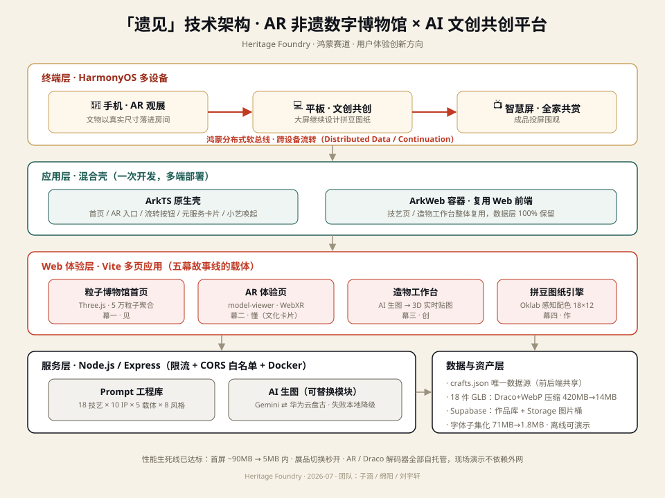

# 「遗见」——把非遗博物馆放进每个人的客厅

> 草稿供刘宇轩迭代，2026-07-17 由 Claude 基于项目发展建议书生成

- **赛事**：第十一届（2026）"中国高校计算机大赛—人工智能创意赛" · 鸿蒙赛道 · **用户体验创新**方向
- **项目名**：遗见（英文名 Heritage Foundry，即"非遗造物局"）
- **团队**：子涵 / 绵阳 / 刘宇轩
- **一句话**：一座装在手机里的 AR 非遗数字博物馆，一个人人可参与的 AI 文创共创平台，一套为 HarmonyOS 多设备协同而生的完整体验。

---

## ① 痛点：传承人在老去，年轻人在别处

先看两组数字。

截至目前，国务院已公布五批国家级非物质文化遗产代表性项目，共 1557 项；与之对应的国家级代表性传承人，五批累计认定 3068 人，认定时平均年龄已超过 63 岁（待核实）。中国列入联合国教科文组织非遗名录（册）的项目数量居世界第一，达 44 项（截至 2024 年底，待核实）。名录越拉越长，能亲手做出这些东西的人却越来越少——"人走技失"不是修辞，是每年都在发生的事。

另一端是年轻人。他们并非对传统文化无感：故宫文创年销售额早已超过 10 亿元（待核实），马面裙在近两年的春节屡屡卖到断货（待核实）。年轻人愿意为传统之美买单，缺的是一条足够低门槛的路径——非遗在博物馆的玻璃展柜里，在县城的工坊里，在纪录片的旁白里，唯独不在他们每天摸几十次的手机里、不在他们的客厅茶几上。

两端之间隔着一道触达的断层。过去十年，"非遗进校园""非遗展演"做了很多把人拉到非遗面前的努力；我们想做的方向恰好相反——**把非遗送到人面前**。让一个从没去过景德镇的大学生，在自己的出租屋里绕着一只真实尺寸的青花瓷瓶走一圈，看清釉面上的每一道笔触，然后亲手把它变成一件属于自己的东西。

## ② 方案：一句话说清我们做什么

**「遗见」——把非遗博物馆放进每个人的客厅。**

它是一座 AR 非遗数字博物馆：打开手机摄像头，一件苗绣绣绷、一只景德镇瓷瓶，以真实尺寸落在你家茶几上，可环绕观看，可凑近细看针脚与釉色。

它也是一个 AI 文创共创平台：看懂一件文物的故事之后，你可以选一个喜欢的流行 IP 与这项技艺碰撞，AI 生成文创设计图，实时贴在 3D 载体上预览，再一键变成一张拼豆图纸和一份材料清单——屏幕上那件文物，周末就能亲手拼出来。

"遗见"，即与遗产相见。我们希望年轻人与非遗的第一次见面，不发生在展柜的玻璃外，而发生在自己的生活里。

## ③ 创新点：三件别人没有的东西

**创新点一：完整的体验链路「看 → 懂 → 创 → 作 → 传」。** 市面上的 AR 博物馆类应用（含多个小红书高赞案例）普遍止步于"看"。「遗见」是一条走得通的完整链路：AR 观赏（看）、故事卡点读（懂）、AI 共创设计（创）、拼豆图纸落地（作）、多设备流转分享（传）。评委会记住的不是某个功能，而是"一件文物从展柜走到手心"的全过程。

**创新点二：拼豆图纸——从屏幕到手心的独家能力。** AI 生成的设计图，30 秒内转换为可实际制作的拼豆图纸：图像经网格化采样生成 18×12 图纸，用 Oklab 感知色差算法匹配市售拼豆色号，同步输出逐色材料清单。这是全链路里"数字变实体"的关键一跳，也是目前同类产品中未见的能力。

**创新点三：非遗 × 流行 IP 的共创引擎。** 我们没有把 AI 生成做成一个裸的输入框，而是构建了 15 项技艺 × 10 个流行 IP × 5 种载体 × 8 种视觉风格的导演式 prompt 模板库，并在服务端做二次增强。用户三次点选就能得到一张文化上站得住、视觉上够精致的设计图——AI 生成有边界、有文化准确性，而不是开盲盒。

## ④ 技术架构

整体架构分五层（自上而下）：

- **应用壳层（HarmonyOS）**：ArkTS 原生壳承载首页、AR 入口与跨设备流转控制；技艺浏览与创意生成工作台通过 ArkWeb 容器复用现有 Web 实现——原生保体验，Web 保速度，兼顾"一次开发多端部署"到手机 / 平板 / 智慧屏。
- **体验渲染层**：Three.js WebGL 渲染 3D 展品与粒子博物馆首页；AR 采用 model-viewer / WebXR 路线（安卓走 ARCore，iOS 走 AR Quick Look，鸿蒙端经 ArkWeb 承载），决赛阶段评估华为 AR Engine 原生方案作为升级路径。
- **AI 生成层**：当前接入 Gemini 图像生成接口，配合服务端 prompt 二次增强；该层为可替换模块，可切换至华为云盘古等国产多模态模型，不影响上层体验。
- **数据与资产层**：Supabase 承载作品库与图片对象存储（Storage 桶）；18 项非遗技艺结构化数据统一在 crafts.json 唯一数据源（前后端共享）；展品级 GLB 模型经 Draco + WebP 压缩管线处理（420MB → 14.2MB），支撑移动端与 AR 秒开。
- **分布式协同层**：基于鸿蒙分布式软总线，承载手机 → 平板 → 智慧屏之间的跨设备流转与投送，是"传"这一幕体验的底座。

> 架构图源文件：`docs/初赛材料/架构图.svg`（矢量图，可直接嵌入 PDF / 调整配色）

## ⑤ 鸿蒙结合：为什么这个体验必须发生在 HarmonyOS 上

我们不是"顺便适配鸿蒙"，而是有一个真实痛点只有鸿蒙能解：**AR 观赏与共创天然需要多块屏幕接力**——手机适合随手把文物"放"进房间，但屏幕太小，不适合精细设计；设计适合在平板上做；成品最适合投到大屏与家人朋友共赏。这条设备接力链，在鸿蒙的设备互联体系里是原生的、无缝的，在其他平台上则是断裂的。逐条对应官方特性：

1. **跨设备流转**：手机上 AR 看到一半，一键流转到平板继续文创设计，进度、参数、模型状态无缝接续——这是鸿蒙分布式能力的招牌场景，也是我们故事线的第五幕。
2. **元服务卡片**：「今日文物」桌面卡片，每天推送一件文物与一句故事，用户不必打开应用即可轻量触达非遗——把"每天见一面"变成习惯。
3. **小艺语音**："小艺小艺，看看苗绣"，语音直达 AR 观赏，符合客厅场景下自然高效的交互习惯。
4. **一次开发多端部署**：同一套工程覆盖手机（看与作）、平板（创）、智慧屏（传），三种屏幕三种角色，正是鸿蒙"一次开发多端部署"设计理念的具体演绎。

## ⑥ 体验设计：五幕故事线

官方对用户体验创新方向的定义是"**围绕 UI/UX 设计创新，打造兼具高端精致视觉与自然高效交互的作品**"。我们把整个产品设计成一场三分钟就能演完的五幕剧，每一幕都对照这句话来打磨。

**幕一 · 见｜文物走出展柜。** 用户打开应用，首先看到的是粒子博物馆首页：5 万个粒子在 18 件文物模型之间流动形变（该首页已实现），这是"高端精致视觉"的第一印象。点击「带它回家」，摄像头开启，一只景德镇瓷瓶以真实尺寸稳稳落在茶几上——用户绕着它走，蹲下来平视它，像在博物馆里一样，只是没有玻璃。

**幕二 · 懂｜点读文化卡片。** 用户点击模型上的热点，一张故事卡轻轻浮起：这项技艺从哪里来、谁还在做、为什么快要失传。文案克制，一屏讲完，不堆术语——先让人对"物"动心，再让人对"事"上心。

**幕三 · 创｜AI 共创设计。** 用户选择一项技艺、一个流行 IP、一种载体（帆布包 / 手机壳等）与一种视觉风格，点击生成。数秒后 AI 生成的设计图实时贴到 3D 载体模型上，可拖动旋转、放大端详。生成过程有明确的进行中状态与失败降级，交互不让用户猜。

**幕四 · 作｜图纸变成实物。** 用户对设计满意后，一键生成拼豆图纸：18×12 网格逐格显示色号，配套逐色材料清单可直接下载。屏幕上那个图案，周末采购一盒拼豆就能拼出来，挂在自己的包上。

**幕五 · 传｜多设备共赏。** 手机上看到一半，用户把体验流转到平板上继续精修设计；完成后把成品投上智慧屏，全家人围坐一起看——奶奶认出了她年轻时绣过的纹样。跨设备流转在这一幕自然发生，不是功能演示，而是情感场景。

视觉语言上，整体沿用朱砂红、孔雀绿、鎏金黄、靛青蓝的国潮色系，以深墨与瓷白平衡；动效只服务于注意力与反馈（生成中脉冲、图纸扫描线入场），支持 reduced motion，关键操作全程有状态可循——精致但不喧哗，炫酷但不失控。

[此处插入UI稿]

## ⑦ 落地与数据：不是 PPT，是已经跑起来的产品

- **资产已就位**：18 项非遗技艺结构化数据（苗绣、剪纸、唐卡、景德镇陶瓷、南京云锦、皮影、扎染等，每项含故事卡、3D 模型与主题色），420MB 展品级 GLB 三维模型经 Git LFS 管理，15×10×5×8 的 prompt 模板库已建成。
- **五步产品闭环已跑通**：技艺浏览 → AI 生成设计图 → Three.js 3D 载体实时贴图 → 拼豆图纸与材料清单 → 作品保存（Supabase）。全链路配有降级容错：未配置 AI 或数据库时服务照常启动并明确提示，演示稳定性有保障。
- **已完成（7 月 17 日）**：GLB 模型压缩管线落地（Draco 几何压缩 + WebP 纹理，18 件模型 420MB → 14.2MB，展品切换秒开）；字体子集化（71MB → 1.8MB）与首屏优化（约 90MB → 5MB 以内）；Web AR 页上线（`<model-viewer>`，安卓/鸿蒙浏览器可把文物以真实尺寸放进房间，解码器自托管、离线可演示）；生图 API 限流、作品图 Supabase Storage 存储、Docker + CI 部署链就绪。
- **进行中**：15 秒 AR 实拍演示视频（7 月下旬完成）；公网演示链接部署。
- **项目经受过检验**：同一底座曾参加软件杯、华为X挑战杯（获奖励）等赛事，经历过真实路演与评审。
- **演示链接**：[此处插入演示链接]（部署上线中，提交前补充）

## ⑧ 团队与规划

**团队分工**（三人，跨校组队）：

| 成员 | 职责 |
|---|---|
| 子涵 | 首页与前端主架构，粒子博物馆首页作者，项目统筹 |
| 绵阳 | AR 与 3D 技术调研，model-viewer POC，3D 模型资源（Tripo 额度） |
| 刘宇轩 | 创意书与申报文档，赛事信息跟踪与线上支持 |

**复赛与决赛里程碑**：

- **8 月 · 主题"能跑"**：性能优化全部落地（模型压缩、字体子集化、首屏 5MB 内），AR 页正式版（平面放置 + 真实尺寸 + 热点卡片），部署上线拿到正式演示链接。验收标准：手机扫码，10 秒内文物出现在桌面上。
- **9 月 · 主题"鸿蒙"**：ArkTS 原生壳 + ArkWeb 混合应用在 DevEco Studio 可编译运行，跨设备流转演示一镜到底；9 月 30 日复赛截止前留足一周缓冲提交。
- **10–11 月 · 主题"惊艳"**：评估华为 AR Engine 原生版本，补齐元服务卡片与小艺唤起中的一到两项；答辩现场的目标只有一个——让评委亲手用手机把一件文物放在讲台上。

---

## 附：关键词自查表

| 关键词 | 是否出现在正文 | 位置 |
|---|---|---|
| 鸿蒙 | ☑ | ④架构、⑤鸿蒙结合、⑧规划等多处 |
| HarmonyOS | ☑ | 开头一句话、④应用壳层、⑤标题 |
| 分布式 | ☑ | ④分布式协同层、⑤跨设备流转（分布式软总线） |
| 跨设备流转 | ☑ | ④、⑤第 1 条、⑥幕五、⑧ 9 月里程碑 |
| 元服务 | ☑ | ⑤第 2 条（元服务卡片）、⑧决赛规划 |
| 一次开发多端部署 | ☑ | ④应用壳层、⑤第 4 条 |
| AR | ☑ | 全文贯穿：②方案、④体验渲染层、⑥幕一、⑦ POC |
| 用户体验创新 | ☑ | 文档头赛道信息、⑥体验设计（官方定义原文） |
| AI 生成 | ☑ | ③创新点三、④ AI 生成层、⑥幕三 |
